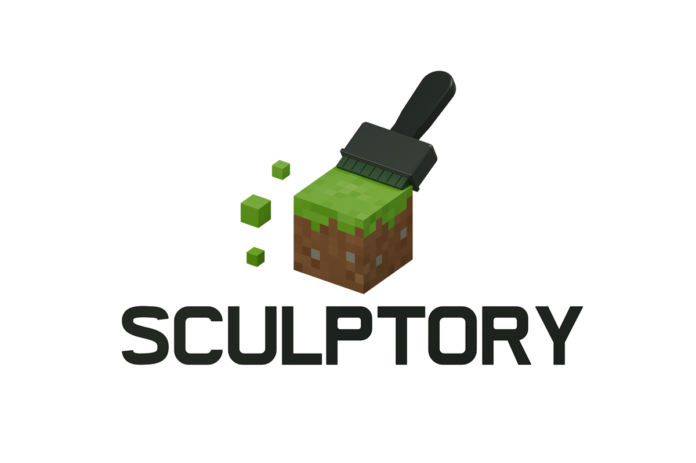
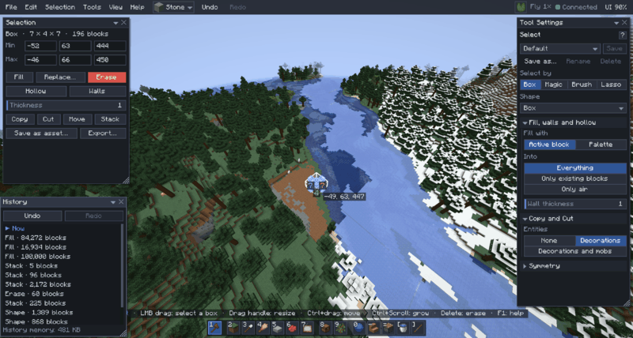

# Sculptory

<p align="center"></p>

Sculptory is an open-source world editor for Minecraft builders, for **Fabric 1.21.1**. Press `B` and the game turns
into an editor: floating windows, a tool palette, brushes that shape terrain, selections you can fill, copy, turn and
stack, schematics, a shared library, scatter and one undo history for all of it. It works in singleplayer and on
dedicated servers, where the server decides who may edit.

> **Alpha.** 0.3.0-alpha is the first public release. Most of it is covered by automated tests, but parts haven't
> been played much yet. Keep backups of worlds you care about, and see [Known limits](docs/wiki/faq.md#known-limits).



## Features

- **Editor mode and windows.** `B` opens the editor (best in Creative, to fly): tools, settings, history and the library live
  in windows you can move, resize and hide. A menu bar, `Ctrl+K` to find any command by name, `F1` for every key. Every
  key can be rebound.
- **Selections and operations.** Select a box, a sphere, cylinder, cone or pyramid, connected blocks (magic select),
  or paint a selection with a brush or a lasso. Fill, Replace (keeping stair shapes, or a whole block family), Erase,
  Hollow, Walls, Overlay, Naturalize and Update blocks, with progress and cancel, up to millions of blocks.
- **Masks.** Limit every edit, or one brush, to the blocks you choose: by block or tag, on top of, under or next to
  something, solid, height, slope, inside the selection, random, each with "not".
- **Terrain and Weather brushes.** Raise, Lower, Smooth, Flatten, Paint and Palette Paint up to radius 32, on any
  surface (walls and overhangs too), with falloff and symmetry. The Weather brush erodes, fills in, roughens or melts.
- **Shape brush with lines.** Click to place spheres, cylinders, cones, cubes and pyramids, drag to paint them, or sweep
  them along straight lines, curves and hanging cables.
- **Paste, move and stack** with rotate, flip and upside-down flip, ghost previews and a placement gizmo. Entities come
  along (item frames, armour stands, optionally mobs).
- **Schematics.** Import and export `.schem` (WorldEdit-compatible), `.litematic` and structure `.nbt` files.
- **Library.** The server's shared folder of schematics and block palettes, with folders, per-asset access and
  "shared with me".
- **Scatter** vanilla trees and features, your own schematics, rocks and plants over an area, with rotations, mirrors
  and a preview before you commit. `Alt+click` places one.
- **Tinker.** Change one block's properties, a sign's text or an entity in place, by scrolling over it.
- **Builder mode.** Hold `G` in normal creative play for a ring of powers, without opening the editor.
- **Jump.** `J` puts you on the block you look at, `Shift+J` through the wall.
- **More tools:** Generate (roads, roofs, lines and curves), Extrude (pull out, carve in, smear a face), Fluid (flood,
  drain, balls of water or lava), palettes and mix patterns, presets for every tool, symmetry.
- **History and undo.** One `Ctrl+Z` / `Ctrl+Y` history for every tool, a History window to jump to any point, and
  undo that keeps what other players changed since. The history is saved with the world and survives restarts and
  crashes.
- **Permissions for servers.** Permission nodes per tool (`sculptory.*`) through any permissions mod, such as
  LuckPerms; operators by default. Size limits, rate limits and job queues keep one player from stalling the server.
- **In-game tutorial and wiki.** Short lessons that run in your own world, and the whole [wiki](docs/wiki/home.md)
  readable in game (Help > Wiki).

<p>


</p>
<p>


</p>

## Install

| You need | Version |
|---|---|
| Minecraft: Java Edition | 1.21.1 |
| [Fabric Loader](https://fabricmc.net/use/) | 0.16.14 or newer |
| [Fabric API](https://modrinth.com/mod/fabric-api) | 0.116.4+1.21.1 or newer |
| Java | 21 |

1. Install Fabric Loader for 1.21.1 and put Fabric API and the Sculptory jar into your `mods` folder.
2. **Singleplayer** works with that alone: you can edit in every world you own.
3. **On a server**, put Fabric API and the **same Sculptory jar** on the server and on every client that wants to edit.
   By default operators (op level 2 or higher) may edit; a permissions mod can decide per player or group.

Downloads: [GitHub Releases](https://github.com/thearticulateidiot/sculptory/releases) (Modrinth and CurseForge pages
follow). [Server setup](docs/wiki/server-setup.md) in the wiki has the details: updating, which build you have, removing
the mod.

## Quick start

| Key | What it does |
|---|---|
| `B` | Open and close the editor |
| `1`–`9`, `0`, `-`, `=`, `[`, `]`, `\` | The 15 tools (Select, Raise, Lower, Smooth, Flatten, Paint, Palette Paint, Place, Scatter, Shape, Generate, Extrude, Fluid, Tinker, Weather) |
| `Ctrl+Scroll` | Tool size |
| `Ctrl+Z`, `Ctrl+Y` | Undo, redo |
| `Ctrl+C`, `Ctrl+X`, `Ctrl+V` | Copy, cut, paste |
| `R`, `F`, `V` | Rotate, flip, flip upside down |
| `Enter` | Place or commit |
| `Ctrl+M` | Mask on or off |
| `Ctrl+K`, `F1` | Find a command, show every key |
| `G` (hold, outside the editor) | Builder mode's ring of powers |
| `J`, `Shift+J` | Jump onto a block, through a wall |

New to it? Open the editor and pick **Help > Tutorial**. All keys: [Keys](docs/wiki/keys.md).

## Servers

[Server setup](docs/wiki/server-setup.md) covers installing, `config/sculptory/server.json` and the `/sculptory`
commands; [Permissions](docs/wiki/permissions.md) lists the nodes, with LuckPerms examples. Every setting, command
and limit is in [Server configuration](docs/wiki/config.md).

## Documentation

- [Wiki](docs/wiki/home.md): the player guide, also in game
- [Server setup](docs/wiki/server-setup.md), [Permissions](docs/wiki/permissions.md) and
  [Server configuration](docs/wiki/config.md): for server admins
- [Known limits](docs/wiki/faq.md#known-limits) and the [changelog](CHANGELOG.md)
- For developers: [CONTRIBUTING.md](CONTRIBUTING.md): building, tests and where the code lives

## Building from source

You need a JDK 21; the Gradle wrapper fetches everything else.

```sh
./gradlew build        # Linux and macOS: compile, test, and build modules/fabric/build/libs/sculptory-<build id>.jar
./gradlew assemble     # the jar only, without tests
```

On Windows, `scripts/gradle.ps1 <tasks>` runs the wrapper with the JDK in `$env:SCULPTORY_JDK` (or a portable JDK in a
`toolchains\jdk-21*` folder beside the repository, or `JAVA_HOME`). `check` runs the JUnit tests and the headless
Fabric GameTests. [CONTRIBUTING.md](CONTRIBUTING.md) explains the dev client, GameTest filters, render-mod checks and
release builds.

## Contributing

Bug reports, ideas and pull requests are welcome: see [CONTRIBUTING.md](CONTRIBUTING.md). Commits are signed off under
the Developer Certificate of Origin. Report security problems privately, as [SECURITY.md](SECURITY.md) describes.

## Licence

The code is **AGPL-3.0-or-later**, with an additional permission to combine it with Minecraft, Fabric and other mods;
the documentation and wiki are **CC BY-SA 4.0**. Modpacks and servers may use Sculptory freely; forks need a name of
their own. See [docs/LICENSING.md](docs/LICENSING.md) for a plain-language summary, [NOTICE.md](NOTICE.md) for the
permission, terms and third-party notices, and [TRADEMARKS.md](TRADEMARKS.md) for the name.

Sculptory is not affiliated with Mojang Studios or Microsoft. "Minecraft" is a trademark of Mojang Synergies AB.
