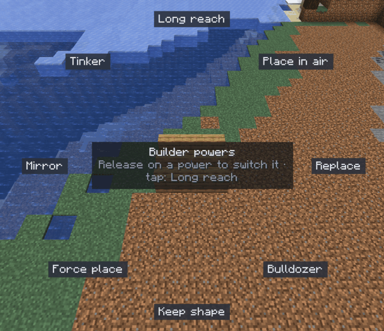

# Builder mode

[Home](home.md) · [Build faster](home.md#build-faster)

Builder mode is for building block by block in normal creative play, with a few powers switched on: reach 64 blocks, place into the air, sweep blocks away, mirror what you do. Use it when the editor is too much for the job and vanilla is too little. While a power is on, every click goes into the editor's history, so `Ctrl+Z` takes it back.

## Switch powers on and off

1. Outside the editor, hold `G`: a ring of powers appears in the middle of the screen. The game keeps running.
2. Move the mouse onto a power; its name and what it does show in the centre.
3. Let go of `G` to switch that power on or off. You can also left-click powers while the ring is open; `Esc` closes it.
4. A short tap of `G` switches the last power you toggled (Long reach, the first time).

Powers that are on show as small tags above the hotbar. With no power on, the game plays as usual and nothing goes into the history. Powers are forgotten when you close the game.

## The powers

| Power | What it does |
|---|---|
| Long reach | Place and break up to 64 blocks away (the server may set less) |
| Place in air | Aiming at nothing places the block 5 blocks in front of you |
| Replace | Right-click swaps the block for the one in your hand and keeps its facing, half and shape. A chest still opens unless you sneak |
| Bulldozer | Hold left-click and sweep: every block the crosshair crosses goes, as one undo step. Hold `Shift` as you start to take only the first block's kind |
| Keep shape | Neighbours stay as they are: fences don't join, stairs don't turn, water doesn't flow |
| Force place | Place where the game refuses: a torch on glass, a flower on stone |
| Mirror | Repeats every placement and break under the editor's symmetry: set the centre with `M` in the editor and a Symmetry mode in the Place tool's settings, or the click happens unmirrored with a hint |
| Tinker | Hold `Alt` to aim: `Alt+Scroll` changes the shown property, `Alt+Shift+Scroll` picks another, `Alt+left-click` opens a small panel. Sign text, poses and the rest need the editor's [Tinker](tinker.md) tool |

## Undo outside the editor

`Ctrl+Z` and `Ctrl+Y` work while the editor is closed and step through the same history as the editor: builder-mode clicks and editor edits alike.

## Rules

- Needs Creative mode, the `sculptory.builder` [permission](permissions.md) and a server running this Sculptory version.
- Spawn protection, claims and areas an edit is working on refuse the click; the reason shows above the hotbar. A block whose other half would land there (a bed's head) is refused whole.
- The server allows about 100 blocks a second. Beyond that a click is refused with "Slow down", and a sweep leaves those blocks standing.
- Command, structure and jigsaw blocks stay with operators, Force place or not.
- A bucket, bone meal, flint and steel or a spawn egg works as in vanilla and can't be undone. Mobs and frames that drop when a block goes aren't put back by undo.

## Related

- [Tinker](tinker.md)
- [History](history.md)
- [Symmetry](symmetry.md)
- [Keys](keys.md)
