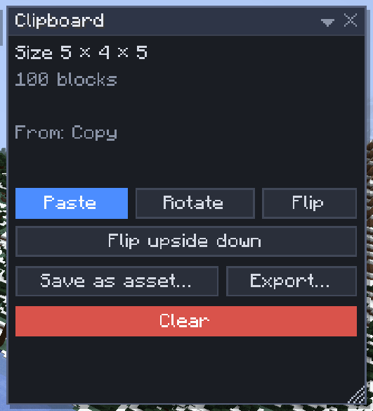

# Clipboard

[Home](home.md) · [Copy, paste and share](home.md#copy-paste-and-share)

The clipboard holds what you last copied or cut: blocks, their contents and the entities in them. From there you paste it with [Place](place.md), save it to the [Library](library.md) or export it to a file. There is one clipboard per player, kept on the server.

## Copy and cut

1. Select what you want with **Select** (`1`).
2. Press `Ctrl+C` to copy, or `Ctrl+X` to cut (the blocks are cleared, as one undo step).
3. Press `Ctrl+V` to paste: a ghost follows the pointer; `Enter` places it.

## The Clipboard window

**View > Clipboard** shows what is on the clipboard and its size.

| Button | What it does |
|---|---|
| Paste | Starts placing it (`Ctrl+V`) |
| Rotate, Flip, Flip upside down | Turn or mirror the ghost; with no ghost showing, the next paste ("Next paste upside down") |
| Save as asset… | Saves it to the library, in `.schem`, `.litematic` or `.nbt` |
| Export… | Writes a file into `sculptory/exports/` in your game folder: see [Import and export](import-export.md) |
| Clear | Forgets the clipboard on this client |

## Entities

The Select tool's **Entities** setting decides what comes along with the blocks.

| Entities | What comes along |
|---|---|
| Decorations | Item frames, paintings, armor stands, displays, minecarts, boats (the default) |
| Decorations and mobs | Also animals, villagers and other mobs |
| None | Blocks only |

Players and dropped items never come along.

## Tips

- Copying again replaces the clipboard, and it is gone when you disconnect: save what you want to keep as an asset.
- A copy counts the whole box around the selection, 2,097,152 blocks at most by default.
- Chests keep their contents; command blocks and other operator-only data need the `nbt.operator` [permission](permissions.md).
- To turn a copy into a Scatter variant, use **Add clipboard** in [Scatter](scatter.md).

## Related

- [Place](place.md)
- [Library](library.md)
- [Import and export](import-export.md)
