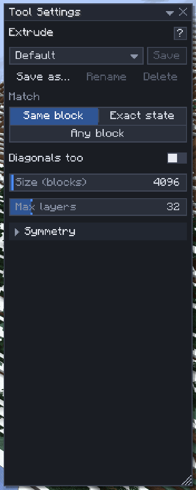

# Extrude

[Home](home.md) · [Shape the land](home.md#shape-the-land)

**Extrude** (`=`) takes a flat face of blocks, a wall, a floor, a ceiling or a roof slope, and pulls it out by whole layers, carves it in, or smears it along. Use it to thicken a wall, cut a doorway, raise a floor or push a pillar out of a facade without selecting anything first.

## Extrude a face

1. Press `=`.
2. Aim at a wall, floor or ceiling: the connected flat face of matching blocks lights up, so you see exactly what will move.
3. Left-drag away from the face to pull layers out, or into it to carve them away. The ghost shows the layers as you drag.
4. Let go to build it. `Esc` while dragging cancels.

One drag is one undo step, named **Extrude** or **Carve** in the History window.

## More ways to drag

| Drag | What it does |
|---|---|
| Left-drag | Pull the face out or carve it in |
| `Ctrl+drag` on a side of the selection | Works on that whole side of the selection box, whatever blocks it holds |
| `Alt+drag` | **Smear**: slides the face along its plane, copying it as it goes |
| `Alt+Shift+drag` | Slides the face out or in without leaving a copy behind |

## Settings

| Setting | What it does |
|---|---|
| Match | Which blocks join the face: **Same block** (every oak plank), **Exact state** or **Any block** (everything but air) |
| Diagonals too | Blocks that touch the face only at a corner join it too |
| Size (blocks) | The face stops growing after this many blocks, default 4,096, and says so |
| Max layers | The most layers one drag pulls out or carves, default 32 |
| Symmetry | Repeat the drag on mirrored or turned copies of the face: see [Symmetry](symmetry.md) |

## Tips

- Cut a doorway: select the opening with [Select](select.md), then `Ctrl+drag` its front side into the wall.
- Thicken a wall: aim at it and drag one layer out. Carve removes the face's layer, so the surface moves in by the number of layers.
- A face that stops early hit the **Size** limit: raise it, or use **Exact state** to keep other blocks out.
- Extrude needs the `region` [permission](permissions.md).

## Related

- [Select](select.md)
- [Shape brush](shape-brush.md)
- [Symmetry](symmetry.md)
