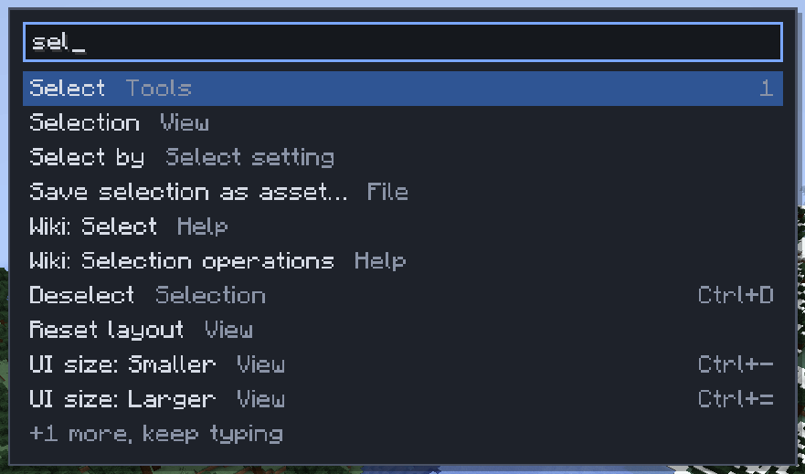

# Finding things

[Home](home.md) · [Start here](home.md#start-here)

You never need to remember a key or a menu. Every action is in a menu, `Ctrl+K` finds it by name, `F1` lists every key, and this wiki explains each tool. Hover almost anything for a tooltip.

## Find a command

1. Press `Ctrl+K`.
2. Type part of a name: a command, a tool, a window, a wiki page ("Wiki: Shape brush"), or a setting or preset of the active tool.
3. Press `Enter`, or click a result. Commands you ran recently are remembered.

## Menus

Click **File**, **Edit**, **Selection**, **Tools**, **View** or **Help** in the top bar. Each item shows its key. A dimmed item can't run right now, and its tooltip says why: no selection, no clipboard, a missing permission.

## The key sheet

`F1` lists every key as you have it bound, grouped like the Keys window, in up to three columns so it fits your screen. Type to filter it by what an action does ("undo", "select") or by a key ("ctrl+d"). **Change keys…** opens the Keys window. `F1`, `Esc` or a click outside closes it.

## The wiki

**Help > Wiki** opens this wiki in a window; **View > Wiki** shows and hides it. Its top row has **Back**, **Forward**, **Home** and **Pages**, which drops down every page grouped as on the home page, with a search box that finds page titles and headings. Links open in the window; a picture opens full size on a click. Once you have clicked on a page, `Backspace` or `Alt+Left` goes back and `Alt+Right` forward. The **?** beside a tool's name in Tool Settings opens that tool's page, and a tutorial step's **Learn more** opens the matching section.

## Notifications

A toast at the bottom shows each result or refusal for a few seconds. Missed one? **View > Notifications** keeps the last 100.

## Tips

- **Help > Quick start** shows the first-visit card again, with its **Start tutorial** button.
- The hint line above the palette lists the active tool's keys for what you can do right now.
- `Tab` hides every window when you want to see the world; `Tab` again brings them back.

## Related

- [Keys](keys.md)
- [The screen and windows](screen-and-windows.md)
- [Tutorial](tutorial.md)
