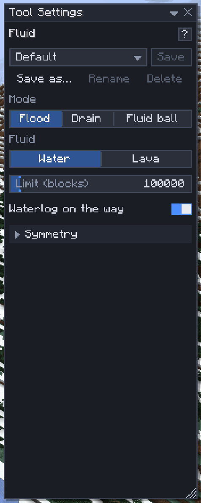

# Fluid

[Home](home.md) · [Shape the land](home.md#shape-the-land)

The **Fluid** tool (`[`) adds and removes water and lava: fill a basin to a level, drain a lake, or paint balls of fluid. **Mode** picks Flood, Drain or Fluid ball; **Fluid** picks Water or Lava. Use it for moats, ponds, canals, lava pools and for emptying a flooded build.

## Flood or drain

1. Press `[` and set the **Mode**.
2. **Flood:** aim at a block beside the air you want filled, at the height the surface should reach. The air next to the face you aim at sets the level.
3. **Drain:** aim at the water or lava.
4. A blue outline shows every block that will change, before you click. It grows while the search runs ("Searching… N blocks" in the hint line) and stops at the limit, the selection box or chunks your game hasn't loaded.
5. Click. The flood or drain is one undo step, named **Flood** or **Drain** in the History window.

A flood fills the connected air at or below the level with still fluid. It lies still until a block beside it changes, then flows like any water; [undo](history.md#undo-and-redo) takes back what it did.

## Fluid ball

Set **Mode** to **Fluid ball**, set the radius with `Ctrl+Scroll`, then click or drag as with the [Shape brush](shape-brush.md). Each press is one undo step.

## Settings

| Setting | What it does |
|---|---|
| Limit (blocks) | The most blocks a flood or drain takes, default 100,000 |
| Waterlog on the way | Flood also waterlogs stairs, slabs, fences and the like it touches |
| Also waterlogged blocks | Drain also dries waterlogged blocks; seagrass and kelp go with the water |
| Radius | Ball size, 1–32 |
| Waterlog where possible | The ball waterlogs blocks it can instead of replacing them |
| Symmetry | Repeat the ball on mirrored or turned copies |

## Tips

- To fill a pool to the brim, aim at the inside of its rim.
- Select a box first to keep a flood or drain inside it: a gap in a pool's wall at water level would otherwise flood the room beyond.
- A flood that stops short hit the **Limit**: raise it, or select the area.
- Lava never waterlogs anything, so the waterlog switches disappear for lava.
- Flood and Drain need the `region` [permission](permissions.md); the ball needs `brush`.

## Related

- [Editor mode](editor-mode.md#aim-at-water-and-lava)
- [History](history.md)
- [Shape brush](shape-brush.md)
