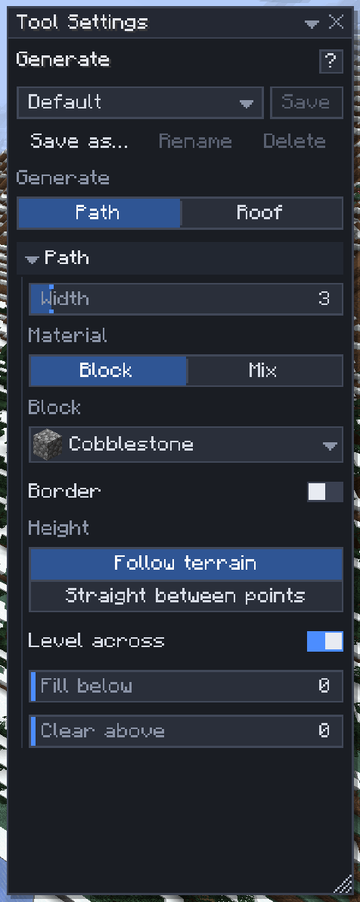

# Generate

[Home](home.md) · [Build faster](home.md#build-faster)

**Generate** (`-`) builds a **road** along points you click, a **roof** over the selection, or a **line** through blocks you click. It shows the result first, and `Enter` builds it as one undo step named **Road**, **Roof** or **Line**. Use it for paths that hug the land, embanked highways, roofs of stairs and slabs that would take an evening by hand, and cables, pipes, arches and beams.

## Build a road

1. Press `-` and set **Generate** to **Path**.
2. Click the ground to add nodes. From two nodes on, the road's footprint is drawn on the terrain with a centre line, and the road itself as a ghost.
3. Drag a node to move it; click one to select it; `Backspace` or `Delete` removes the selected (or last) node.
4. Press `Enter` to build. `Esc` clears the path.

## Build a roof

1. Select the building with [Select](select.md): the box's bottom layer is where the eaves sit.
2. Press `-` and set **Generate** to **Roof**. The roof's outline shows over the selection.
3. Choose the **Style**, **Pitch** and blocks, then press `Enter`.

## Draw a line

1. Press `-` and set **Generate** to **Line**.
2. Click blocks to add points; the line runs through their centres. Click a point to select it, drag it to move it; `Backspace` or `Delete` removes the selected (or last) point.
3. Pick the **Path**: **Straight** from point to point, **Curve** smoothly through every point (drag the last point onto the first for a closed loop), or **Hanging**, sagging between each pair of points by **Sag** blocks, like a rope or a power line.
4. Set the **Thickness** (1–16, `Ctrl+Scroll`) and, from 2 up, the **Profile**: **Round** or **Square**.
5. Press `Enter` to build. `Esc` clears the points.

## Settings

| Setting | What it does |
|---|---|
| Width | Road width, 1–32; `Ctrl+Scroll` |
| Material | One **Block**, or a weighted **Mix**; **Border** adds a second block for the outer columns |
| Height | **Follow terrain** (smoothed along the road) or **Straight between points** |
| Level across | One height across the road's width, or each column on its own ground |
| Fill below, Clear above | Blocks filled under the road, and cleared above it, 0–8 |
| Style | **Gable**, **Hip** or **Shed** (rising from the **Low side**) |
| Pitch | **45° (stairs)**, **Steep** (two up per one across, full blocks) or **Gentle** (one up per two across, slabs) |
| Ridge along, Overhang, Thickness | Which way a gable's ridge runs, how far the eaves reach past the box (0–4), layers under the surface |
| Stairs, Slab, Full block | The roof's blocks: picking the stairs fills in the slab and full block of the same wood or stone |
| Gable walls, Inside | Fill the triangular ends; leave or hollow the space under the roof |
| Path, Sag | The line's shape through its points; how far a hanging span drops at its middle, 0–64 |
| Thickness, Profile | The line's width across, 1–16; round (a tube) or square (a beam) |
| Material (Line) | One **Block**, or a weighted **Mix** |

## Tips

- **Clear above** cuts the road through a forest; **Fill below** builds an embankment across a dip.
- Pick the **Stairs** block first: the slab and full block fill in when they share its name.
- Chunks the road crosses that your game hasn't loaded show as red boxes and stop the build: fly closer.
- A thin **Hanging** line between two towers makes a cable or a rope; a thick **Curve** of stone makes an arch. Blocks are placed as they are: fences and walls in a line don't connect to each other.
- A line reaching into chunks your game hasn't loaded won't build: fly closer.
- Generate needs the `clipboard` and `region` [permissions](permissions.md).
- The [Shape brush](shape-brush.md#sweep-a-shape-along-a-line) sweeps any of its shapes along the same kind of line, and can carve with it.

## Related

- [Select](select.md)
- [Place](place.md)
- [Mix patterns](mix-patterns.md)
