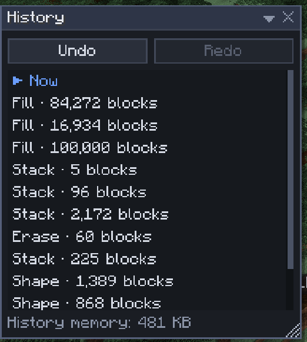

# History

[Home](home.md) · [Select and change blocks](home.md#select-and-change-blocks)

Every edit goes into your own undo history: kept by the server, saved with the world, and yours alone. A brush press, a fill, a paste, a scatter commit, a Tinker change or a builder-mode click is one step each. Nothing is lost when you disconnect, restart or crash.

## Undo and redo

1. Press `Ctrl+Z` to undo and `Ctrl+Y` to redo, or click the arrows in the top bar. Outside the editor the same keys work while [builder mode](builder-mode.md) is installed.
2. Press `H` for the **History** window: one row per step, named after its tool ("Raise stroke · 312 blocks", "Road · 1,284 blocks", "Tinker · Oak Stairs · shape: outer left").
3. Click a step to jump there: steps below **▶ Now** are undone, steps above are redone. Hover a row to see how many steps the jump takes.

Undoing water or lava you placed also takes back what it did afterwards: water that ran out, new sources, ice, grass turned to dirt, obsidian from lava. That holds across restarts too.

## Undo anyway

Undo leaves alone blocks that someone or something changed after your edit. When it had to keep some, a toast offers **Undo anyway** to overwrite them as well. Undo anyway itself can't be undone, and the offer ends when you leave. Redo has the same **Redo anyway**.

## Tips

- 256 steps per player by default (a server setting); the oldest are dropped. The window lists the nearest 64 each way.
- Selection changes, presets and settings aren't in the history: `Ctrl+Z` never moves your selection.
- Changing the radius or strength in the middle of a brush press starts a new step.
- Each player undoes only their own edits; an admin can read everyone's history with `/sculptory history`.
- A big undo shows a job bar with **Cancel**, like any big edit.

## Related

- [Selection operations](selection-operations.md)
- [Fluid](fluid.md)
- [Troubleshooting](troubleshooting.md)
