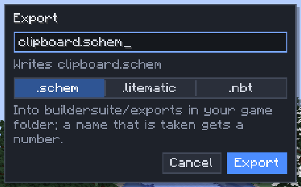

# Import and export

[Home](home.md) · [Copy, paste and share](home.md#copy-paste-and-share)

Builds travel as files: drop one on the game to import it, or export the clipboard to a file for another world, another server or another program. Three formats are read and written.

## Formats

| Format | Made by | Notes |
|---|---|---|
| `.schem` | WorldEdit and most editors (Sponge schematic, versions 1–3) | The default. Biomes in the file are left out |
| `.litematic` | Litematica (versions 2–6) | Every region comes in at its own place; the cells between regions stay untouched when pasted |
| `.nbt` | Vanilla structure blocks | Lists every block, so at most 1,048,576 blocks; structure blocks themselves load only 48 per side |

A file is read by what it holds, so a `.litematic` renamed to `.schem` still reads as Litematica.

## Import

1. Open the editor.
2. Drag a `.schem`, `.litematic` or `.nbt` file from your computer onto the game window.
3. It becomes your clipboard and starts placing: put the ghost down and press `Enter`.

Needs the `schematic.import` [permission](permissions.md). One file at a time; with the Scatter tool active the file goes into the Scatter mix instead. Files up to 16 MiB import by default (the server can allow up to 64 MiB).

## Export

1. Copy the blocks (`Ctrl+C`), or open the Clipboard window.
2. Click **Export…** (Clipboard window, Selection window or **File > Export clipboard…**). The Selection window's button copies the selection first.
3. Type a file name and pick the format: `.schem`, `.litematic` or `.nbt`. The last format you chose is remembered for the session.
4. Click **Export**. The file is written to `sculptory/exports/` in your game folder, and a toast shows the full path.

Needs the `schematic.export` permission. A name that is taken gets a number (`house-1.schem`).

## What the formats keep

- Blocks with their contents (chests, signs), and the entities the copy took along. Operator-only data such as command blocks needs `nbt.operator`.
- `.litematic`: pending block and fluid updates in the file are counted and left out; a toast says how many.
- `.nbt`: a structure over 48 blocks per side exports with a warning, since vanilla structure blocks can't load it (Sculptory can).

## Tips

- Litematica files from Minecraft 1.12 (version 1) and versions newer than 6 are refused with a reason instead of guessed at.
- To share a build with the whole server, save it to the [library](library.md) instead of exporting it.

## Related

- [Library](library.md)
- [Clipboard](clipboard.md)
- [Permissions](permissions.md)
