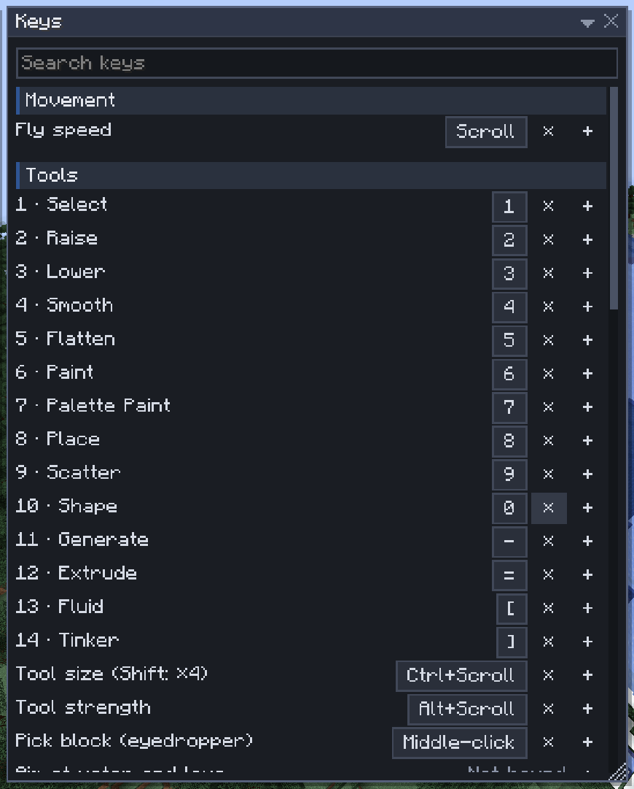

# Keys

[Home](home.md) · [Settings and keys](home.md#settings-and-keys)

Every editor key can be changed, and `F1` always shows the keys as you have them. This page lists the defaults; the pages of the tools say what each key does there.

## Change a key

1. Open **Help > Change keys…** (or **Change keys…** on the `F1` sheet).
2. Click the key's button: it reads "Press keys…".
3. Press the new key, with `Ctrl`, `Shift` or `Alt` if you like. It is saved at once.

`Esc` keeps the old key, `Backspace` removes it, **+** adds a second key for the same action and **Reset** restores the default. A key shown in red collides with another action: hover it to see which.

## Default keys in the editor

| Action | Key |
|---|---|
| Tools 1–15 | `1`–`9`, `0`, `-`, `=`, `[`, `]`, `\` |
| Tool size, strength or height | `Ctrl+Scroll` (`Shift`: steps of 4), `Alt+Scroll` |
| Fly speed | `Scroll` over the world |
| Tinker: next value, another property | `Scroll`, `Shift+Scroll` over a block |
| Pick block (eyedropper) | Middle-click |
| Scatter: place one item of the mix | `Alt+left-click` |
| Symmetry centre (`Shift`: block corner) | `M` |
| Undo, redo | `Ctrl+Z`, `Ctrl+Y` or `Ctrl+Shift+Z` |
| Copy, cut, paste | `Ctrl+C`, `Ctrl+X`, `Ctrl+V` |
| Place or commit | `Enter` |
| Rotate, flip | `R`, `F` (`Shift`: the other way) |
| Flip upside down | `V` |
| Erase selection, deselect | `Delete`, `Ctrl+D` |
| Switch the Mask on or off (every edit; top bar chip) | `Ctrl+M` |
| Jump onto a block, through a wall | `J`, `Shift+J` |
| Nudge selection or ghost | Arrow keys, `PgUp`, `PgDn` (`Shift`: 10 blocks) |
| Remove a path node or line point | `Backspace` |
| Hide or show windows | `Tab` |
| Key sheet, find a command | `F1`, `Ctrl+K` |
| Keyboard into the next window | `F6` (`Shift`: the one before) |
| Library, History | `L`, `H` |
| Editor UI size | `Ctrl+-`, `Ctrl+=`, `Ctrl+0` |

## Outside the editor

| Action | Key |
|---|---|
| Open and close the editor | `B` |
| Builder powers ring (hold; tap: the last power) | `G` |
| Jump onto a block (hold `Shift`: through a wall) | `J` |
| Undo, redo (the editor's chords) | `Ctrl+Z`, `Ctrl+Y` |
| Tinker power: aim, value, property, panel | hold `Alt`, `Alt+Scroll`, `Alt+Shift+Scroll`, `Alt+left-click` |

## Tips

- `B`, `G` and `J` are Minecraft key bindings: change them in Options > Controls > Key Binds, under Sculptory.
- While a text field has the keyboard, keys type into it; press `Esc` to give the keyboard back to the editor.
- In this wiki window, `Backspace` or `Alt+Left` goes back a page and `Alt+Right` forward, once you have clicked on the page.

## Related

- [Finding things](finding-things.md)
- [Tools at a glance](tools.md)
- [Builder mode](builder-mode.md)
