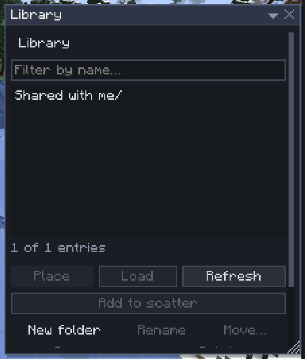

# Library

[Home](home.md) · [Copy, paste and share](home.md#copy-paste-and-share)

The library is the server's shared folder of schematics and palettes: trees, houses, statues, ground mixes, ready for everyone to place. In singleplayer it lives in your game folder. Use it for anything you build more than once.

## Use an asset

1. Press `L` (or **File > Library**).
2. Open a folder, or type part of a name in **Filter by name…**.
3. Select an asset and click **Place** (or double-click it): a ghost follows the pointer, and `Enter` places it. **Load** only puts it on your clipboard; **Add to scatter** makes it a [Scatter](scatter.md) variant.

## Save an asset

1. Click **Save as asset…** in the Selection or Clipboard window, or **Save clipboard as…** in the Library.
2. Type a path such as `trees/oak`, pick the format (`.schem`, `.litematic` or `.nbt`; typing an extension picks it too) and click **Save**.

Without the `library.write` [permission](permissions.md), saves go to your own folder, `_players/<your id>/`, which only you and admins see. Where you may change a folder, **New folder**, **Rename**, **Move…**, **Delete** and **Access…** (who may load an entry) organise it.

## Palettes

Palettes are saved beside the schematics as `.palette.json` files, from Paint, Palette Paint, the Shape brush and Scatter: see [Palettes](palettes.md).

## Tips

- A deleted asset goes to the server's trash for 30 days; an admin can move it back.
- An asset keeps its extension when renamed or moved, so the name always says its format.
- Files copied straight into the server's `sculptory/library/` folder show up in the window.
- A structure file (`.nbt`) lists every block, so it is refused over 1,048,576 blocks; save big builds as `.schem` or `.litematic`.

## Related

- [Import and export](import-export.md)
- [Place](place.md)
- [Palettes](palettes.md)
