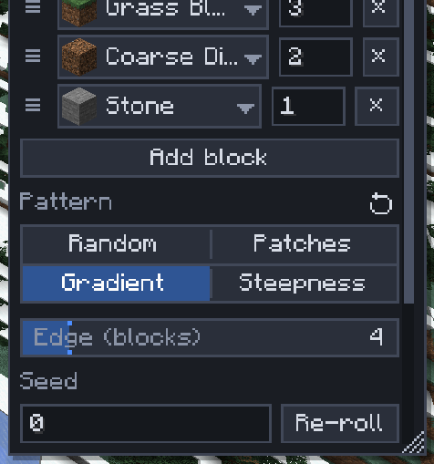

# Mix patterns

[Home](home.md) · [Paint, mix and plant](home.md#paint-mix-and-plant)

A mix is a list of blocks with weights. A **pattern** says how those blocks are laid out: speckled at random, in clumps, fading from one block to the next along a line, or by how steep the ground is. Patterns work in **Palette Paint**, the **Shape brush** (with Blocks set to Mix) and the Select tool's **Fill** and **Walls** (with Fill with set to Palette).

## Set a pattern

1. Build the mix: **Add block**, or middle-click blocks in the world. Set each block's weight (1–1000).
2. Under the mix, pick a **Pattern**.
3. For Gradient, hold `Alt` and left-drag in the world from where the first block should be to where the last one should be. An arrow shows the line; a toast confirms it.
4. Paint, place or fill as usual.

| Pattern | What it does | Its settings |
|---|---|---|
| Random | Each block picked at random by weight: a speckled mix | none |
| Patches | Natural clumps about **Patch size** blocks across; the weights set roughly how much of each block appears | Patch size, Seed |
| Gradient | The mix fades from its first block to its last along the line you drew; each block takes a stretch of the line by its weight | Edge (blocks), Seed |
| Steepness | Flat ground gets the first block, the steepest faces the last, the others in between: grass on flats, stone on cliffs (Palette Paint only) | Edge (degrees), Seed |

**Edge** is how ragged the change from one block to the next is: 0 is a hard line. **Seed** gives the same layout every time; **Re-roll** picks another.

## Order the rows

The order of the mix is the pattern's order, first to last. Drag a row by its **≡** handle up or down to move it, weight and all. A block added by middle-click goes last.

## Tips

- Gradient's line is shared by Palette Paint, the Shape brush and Fill, so draw it once. It is kept until you draw another or close the game. In the Select tool, `Alt+drag` draws it in Box mode only.
- A Gradient without a line is refused with a reminder to draw one.
- A vertical line makes a height gradient: stone at the foot of a cliff fading to snow at the top.
- A [palette](palettes.md) saved from Palette Paint or the Shape brush keeps its pattern and row order. Steepness loaded into the Shape brush becomes Random.
- Weights mean different things: how often (Random, Patches), how long a stretch (Gradient), how many degrees of slope (Steepness).

## Related

- [Palettes](palettes.md)
- [Terrain brushes](terrain-brushes.md#paint)
- [Shape brush](shape-brush.md)
- [Selection operations](selection-operations.md)
