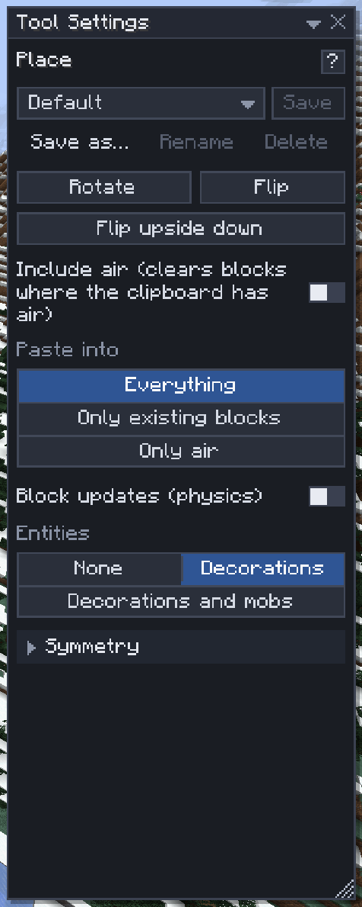

# Place

[Home](home.md) · [Copy, paste and share](home.md#copy-paste-and-share)

**Place** (`8`) puts blocks down from the [clipboard](clipboard.md) or a [library](library.md) asset, and moves or stacks the selection. A ghost shows the result at the pointer first; you turn, flip and nudge it, then confirm with `Enter`. Every placement is one undo step.

## Paste

1. Copy something (`Ctrl+C`), import a file or pick a library asset.
2. Press `Ctrl+V`: the ghost follows the pointer. The tool switches to Place by itself.
3. Left-click to drop the ghost where it is. Drag the gizmo's arrows to move it along an axis, its ring to turn it.
4. Fine-tune: `R` and `Shift+R` turn it, `F` and `Shift+F` mirror it, `V` turns it upside down, the arrow keys and `PgUp`/`PgDn` nudge it (`Shift`: 10 blocks).
5. Press `Enter` to place it, or `Esc` to cancel.

The same buttons sit above the settings: **Rotate · Flip · Flip upside down**. Used with no ghost showing, they set up the next paste instead: the Clipboard window then says "Next paste upside down".

## Move or stack

1. Select the blocks with [Select](select.md).
2. Click **Move** or **Stack** in the Selection window.
3. Place the ghost as above. An upright line marks the pivot the ghost hangs from and turns around; a move also draws a line from where the blocks were. For Stack, drag to set the step between copies and `Ctrl+Scroll` to set how many.
4. Press `Enter`.

Stacked copies keep the selection's orientation: `R` and `F` are refused, but `V` turns every copy upside down in its own box.

## Upside down

`V` turns the contents over inside the same box: the box doesn't move. Stairs, slabs, doors, trapdoors, buttons, levers, lanterns, pistons and the like turn over. Torches, plants, signs, banners, beds, carpets, rails and chests can't be upside down, so they stay as they are, and a toast counts them once the ghost has settled. A two-block plant swaps its halves to stay whole.

## Settings

| Setting | What it does |
|---|---|
| Include air (clears blocks where the clipboard has air) | Off: the clipboard's air changes nothing. Pastes only |
| Paste into | **Everything**, **Only existing blocks** or **Only air** |
| Block updates (physics) | Sand falls, water flows (needs the `physics` permission) |
| Entities | Which entities a move or stack takes along |
| Symmetry | Repeat the placement on mirrored or turned copies: see [Symmetry](symmetry.md) |

## Tips

- Paste with **Only air** to add around a build without overwriting it.
- A move that would put any of the blocks outside the world is refused ("The server couldn't apply that").
- A paste too large to preview shows an outline only, and no count toast.

## Related

- [Clipboard](clipboard.md)
- [Selection operations](selection-operations.md)
- [Library](library.md)
