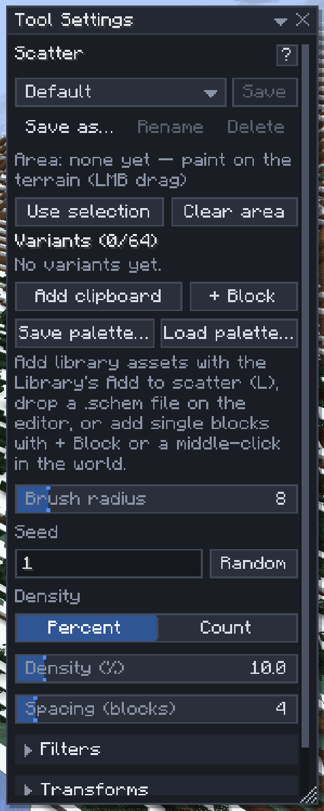

# Scatter

[Home](home.md) · [Paint, mix and plant](home.md#paint-mix-and-plant)

**Scatter** (`9`) spreads trees, rocks, flowers and grass over an area: you paint where, set how many and how far apart, look at the preview, then commit it as one undo step. Use it for meadows, forests, boulder fields and reefs.

## Scatter an area

1. Press `9`.
2. Fill the mix: **+ Block**, or middle-click a block in the world; **+ Tree** or **+ Feature** for vanilla trees, rocks and patches; **Add clipboard** for what you copied; or **Add to scatter** in the [Library](library.md) for a saved tree. Each entry has a weight: how often it is picked.
3. Left-drag on the terrain to paint the area (`Alt+drag` erases part of it), or click **Use selection** to take the selection's footprint. `Alt+click` places one item of the mix right where you point.
4. Look at the preview. Change the density, spacing or seed (**Random** picks a new one) until it looks right.
5. Press `Enter` to commit. Before that, `Ctrl+Z` undoes the last painted stroke and `Delete` clears the area.

## Settings

| Setting | What it does |
|---|---|
| Brush radius | The painting brush, 1–64; `Ctrl+Scroll` |
| Seed | The same seed, settings and terrain give the same scatter |
| Density | **Percent** of the suitable columns, or a target **Count** (up to 131,072) |
| Spacing (blocks) | The least distance between two placements, 0–64; placements never overlap |
| Filters | Slope, Surface height and Only on these blocks: where a placement may stand |
| Transforms | Which turns (0°, 90°, 180°, 270°) and mirroring a placement may pick |
| Fit | Only where it can survive (flowers on grass, cactus on sand), Allow in water, Minimum support under an asset, Column height for sugar cane, cactus, bamboo and kelp |

## Trees and features

**+ Tree** lists the game's own trees: oak, big oak (also with a bee nest), birch, spruce, pine, big spruce and pine, jungle, big jungle, jungle bush, acacia, dark oak, cherry, mangrove, tall mangrove, azalea, swamp oak, the huge nether fungi and the huge mushrooms. **+ Feature** lists a mossy boulder, an ice spike, a moss patch, flower patches (default, plains, meadow, cherry), grass, tall grass, large ferns, sweet berry bushes and pumpkins.

- Every spot grows its own tree, as world generation would (the grass under a trunk becomes dirt, a big oak with a bee nest gets its bees). The preview shows exactly the trees the commit writes.
- **Random** next to the seed re-rolls: other spots, other trees.
- Weights, density, spacing and the filters work as for any entry. Trees are never turned or mirrored (each one is already different).
- With **Only where it can survive** on, a tree grows only where its sapling could stand. A spot where the game won't grow it (an ice spike off snow, a fungus off nylium) is counted as **didn't grow** in the summary.
- Trees grow around the ones next to them, so crowns may touch. Touching trees are committed together: if something was built on one of them since the preview, that whole group is left out (the toast says how many were skipped).
- A tree that would reach a protected or unloaded area, or a block the [Mask](masks.md) keeps out, is left out whole (the summary counts it as **masked** for the Mask). One preview may grow at most `scatter.maxFeatureCells` blocks (1,048,576 by default); more is refused as too large.
- Trees and features need `brush` or `region`, as single blocks do.

## Tips

- Meadow: grass 40, fern 10, two or three flowers at 2–5, density 30%, spacing 0–1.
- Forest: **+ Tree** (oak 10, birch 5, big oak 2), density 5–10%, spacing 5–8; or tree assets from the library with all four turns ticked.
- Water plants go under water and lily pads onto it by themselves; **Allow in water** lets a coral asset replace water for a reef.
- The preview holds the area while it shows, so another player's edit there waits; commit or clear it.
- Scatter needs the `scatter` [permission](permissions.md) (single blocks, trees and features also need `brush` or `region`).

## Related

- [Library](library.md)
- [Palettes](palettes.md)
- [Terrain brushes](terrain-brushes.md)
