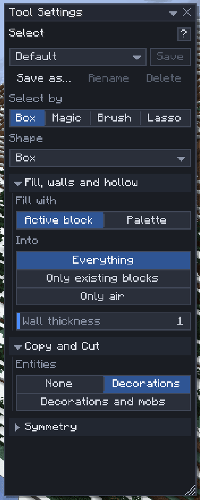

# Select

[Home](home.md) · [Select and change blocks](home.md#select-and-change-blocks)

**Select** (`1`) marks the blocks other commands work on: a box, a shape inside a box, the connected blocks of one kind, or any set of blocks you paint or lasso. Everything in the [Selection window](selection-operations.md), the [clipboard](clipboard.md) and [Place](place.md)'s Move and Stack starts from a selection.

## Draw a box

1. Press `1`.
2. Left-drag from one block to another: the box is drawn between them.
3. Resize: drag a face handle, `Shift+click` a block to grow the box to include it, or `Ctrl+Scroll` over a face to push it in and out.
4. Move: `Ctrl+drag` inside the box, or nudge it with the arrow keys and `PgUp`/`PgDn` (`Shift`: 10 blocks at a time).
5. `Ctrl+D` clears the selection.

To type exact corners, use the fields in the **Selection** window.

## Other ways to select

| Select by | How |
|---|---|
| Box | Drag a box; **Shape** picks the whole box or a sphere, cylinder, cone or pyramid inside it |
| Magic | Click a block: the connected blocks that match it. `Shift+click` adds another group, `Alt+click` removes one |
| Brush | Drag a sphere over blocks to add them; `Alt+drag` removes. **Radius** with `Ctrl+Scroll` |
| Lasso | Drag a loop on the ground: what is inside it, **Height** layers high (`Alt+Scroll`). `Shift+drag` adds, `Alt+drag` removes |

## Settings

| Setting | What it does |
|---|---|
| Shape | Box, Sphere, Cylinder, Cone or Pyramid inside the box. Changing it reshapes the current selection |
| Axis, Tip points | Which way a cylinder runs, where a cone's or pyramid's tip points |
| Match (Magic) | **Same block** (every oak stair), **Exact state** (only that stair, facing that way) or **Any block** |
| Connect through | **Faces** only, or **Diagonals too** |
| Limit (blocks) | Magic select stops after this many blocks, default 100,000 |
| Solid only (Brush) | Skip air, and chunks your game hasn't loaded |

## Tips

- Magic, Brush and Lasso make a block selection: it moves, but it can't be resized. **Convert to box** in the Selection window selects its whole box instead.
- A cone's tip points where **Tip points** says; its base fills the opposite side of the box.
- Selections aren't in the undo history: `Ctrl+Z` undoes edits, not a selection you moved.
- The selection also bounds a flood, a drain and a brush with **Only inside selection** on.

## Related

- [Selection operations](selection-operations.md)
- [Clipboard](clipboard.md)
- [Place](place.md)
