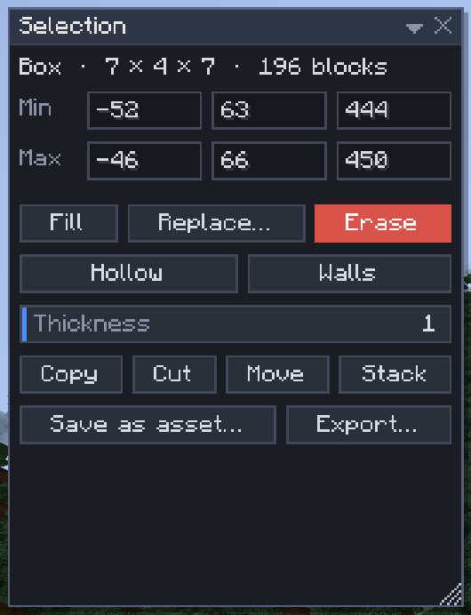

# Selection operations

[Home](home.md) · [Select and change blocks](home.md#select-and-change-blocks)

The **Selection** window (and the Selection menu) changes every block of the selection at once: fill it, swap blocks for others, empty it, keep only its shell, build its walls, lay a layer on top, turn it into natural ground or reconnect its fences and stairs. Each operation is one undo step, however big.

## Fill a selection

1. Select a box or a shape with **Select** (`1`).
2. Pick the block: click the **active block** in the top bar and choose one, or middle-click a block in the world to pick it.
3. Click **Fill**. The selection is filled with that block.

## The operations

| Button | What it does |
|---|---|
| Fill | Fills with the active block or a palette (**Fill with**) |
| Replace… | Turns the **From** blocks into the **To** block or palette, keeping their shape; or swaps a whole wood or stone family (below) |
| Erase | Clears the selection to air (`Delete`) |
| Hollow | Keeps a shell of **Wall thickness** blocks and clears the inside |
| Walls | Builds the side walls of the box, **Wall thickness** thick, in the fill block |
| Overlay… | Lays the fill block or palette on top of every column, 1–16 deep (below) |
| Naturalize… | Grass on top, 3 dirt, then stone, from every column's top down; blocks and depths editable (below) |
| Update blocks | Connects fences, walls, panes, stairs and redstone to their neighbours and fixes the light (below) |
| Copy, Cut | Puts the selection on the [clipboard](clipboard.md) (`Ctrl+C`, `Ctrl+X`) |
| Move, Stack | Drag the selection to a new place, or repeat it in a row: see [Place](place.md) |
| Save as asset… | Saves the selection to the [library](library.md) |

All of them work on boxes, shapes and block selections (magic, brush and lasso select), and repeat on the copies when **Symmetry** is on.

## Replace

1. Select the area and click **Replace…**.
2. **From** starts with the block under your cursor. Click it to pick up to 16 blocks or block tags (such as all logs).
3. **To**: click the block chip, or switch on **To: the Select palette** to use the palette and pattern from the Select tool's settings.
4. **Keep shape** is on by default: stairs keep their facing and half, slabs stay top or bottom, logs keep their direction, waterlogged blocks keep their water. Switch it off to place the plain To block.
5. Click **Replace**.

**Whole family** swaps a whole set of blocks at once. With From **oak planks** and To **spruce planks**, every oak block in the selection becomes its spruce counterpart: oak stairs, slabs, fences, gates, doors, trapdoors, logs, stripped logs, wood, leaves, signs and buttons. Dark oak is left alone. The line under the switches says how many kinds of blocks will swap. It works between any two woods (logs become crimson stems or bamboo blocks where needed), stone families (stone bricks to deepslate bricks, granite, sandstone...), coppers and the 16 colours (white wool, carpet, concrete, glass and beds to red ones). It also works from wood to stone: oak planks to stone turns oak stairs and slabs into stone ones, and the planks themselves into stone. A block without a counterpart stays as it is. Whole family always keeps the shape (a door's top half stays a top half) and swaps block for block, so the palette switch is off while it is on. It needs exactly one From block.

Signs keep their text, and shulker boxes and banners their contents, when Keep shape swaps them for another wood or colour.

## Overlay

1. Choose what to lay with **Fill with** in the Select settings: the active block, or a palette (a palette with air in it scatters flowers or grass).
2. Select the area and click **Overlay…**. Set the **Depth** (1–16) and click **Overlay**.

In every column of the selection the layer goes on top of the **highest block**, and may reach above the selection (so a magic selection of just the grass still gets its layer). The layer grows up through air, short grass and snow layers, and stops at anything else, so it never buries a flower, a torch or a canopy.

## Naturalize

1. Select the terrain and click **Naturalize…**.
2. Pick the **Top** block (grass) and its depth (1), the **Middle** block (dirt) and its depth (3, or 0 for none), and the **Bottom** block (stone).
3. Click **Naturalize**.

From each column's highest block down, the top block goes first, then the middle one, then the bottom one for the rest of the column. Only natural ground changes (dirt, grass, sand, gravel, stone and the other rocks, ores, terracotta, snow blocks, and the blocks you picked): buildings, logs, stairs, chests and plants stay, and a cave keeps its air (the depth counts from the top, cave or not).

## What "the highest block" is

Overlay and Naturalize look down each column of the selection from its top and pass through:

- air, plants and flowers, leaves, short grass and anything else you can replace by placing a block;
- blocks without collision, such as torches, rails, signs and buttons;
- snow layers;
- logs, so a tree is looked past to the ground under it.

The first other block is the column's highest block. When it is water or lava (or seagrass, kelp or another water plant), or it is outside the selection (a block selection with a gap under a roof), the column is left alone. When the selection's top cell of a column has a block right above it (the selection cuts into a hill), the column is buried and left alone too.

## Update blocks

Edits run without block updates, so a fence built in pieces or a stair pasted next to another may not join up. **Update blocks** asks every block of the selection for the shape its neighbours give it, as the game does when you place a block next to it: fences, walls and panes connect, stairs turn corners, redstone wire joins, a lone half of a double chest becomes a single chest (its items stay). It also recomputes the light of the selection, which fixes dark spots and leftover light.

There is no physics: nothing falls, water doesn't flow, and a torch or plant without support stays where it is. Only the blocks' shapes change, so Update blocks is undone exactly.

## Settings

These are in the Select tool's Tool Settings.

| Setting | What it does |
|---|---|
| Fill with | **Active block**, or **Palette**: a weighted block mix (up to 16 blocks) with a [pattern](mix-patterns.md). Fill, Walls and Overlay use it |
| Into | Fill writes **Everything**, **Only existing blocks** (air stays air) or **Only air** (what is there stays) |
| Wall thickness | For Hollow and Walls, 1–16 |
| Symmetry | Repeat the operation on mirrored or turned copies: see [Symmetry](symmetry.md) |

The Replace, Overlay and Naturalize dialogs remember their choices until you close the game.

## Tips

- Edits run without block updates: sand doesn't fall, water doesn't flow, fences don't reconnect. That keeps a fill exactly as you asked for it. Use **Update blocks** afterwards to connect what should connect.
- **Only air** fills the gaps around a build without touching it; **Only existing blocks** repaints a build without filling its rooms.
- To re-wood a house, select it and Replace oak planks with spruce planks with **Whole family** on.
- Over 500,000 blocks you are asked first. A big edit shows a job bar with **Cancel**.
- To hollow a box, it must be thicker than two walls, or nothing is left inside to clear.

## Related

- [Select](select.md)
- [Clipboard](clipboard.md)
- [Mix patterns](mix-patterns.md)
- [Masks](masks.md)
