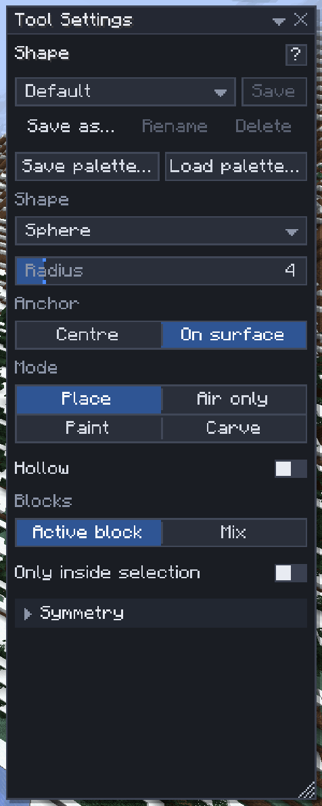

# Shape brush

[Home](home.md) · [Shape the land](home.md#shape-the-land)

The **Shape brush** (`0`) places a solid sphere, cylinder, cone, cube or pyramid where you click, or carves one out. Use it for domes, pillars, boulders, tunnels and towers, and for quick lumps of material to sculpt afterwards with the [terrain brushes](terrain-brushes.md).

## Place shapes

1. Press `0`.
2. Pick the **Shape** and set the **Radius** (`Ctrl+Scroll` over the world) and, for anything but a sphere, the **Height** (`Alt+Scroll`).
3. Point at a block: the outline shows what one click places.
4. Click for one shape, or drag to paint a smooth tube of them.

One press is one undo step. By default it places the top bar's active block: middle-click a block in the world to pick it.

## Sweep a shape along a line

Set **Draw** to **Along a line**, and clicks add points instead of placing shapes. The current shape, with its size, **Hollow** and **Mode**, is swept along a line through the points, and `Enter` builds the whole sweep as one undo step named **Shape line**.

1. Click blocks to add points; each point is where a click would centre the shape (so **Anchor** still applies). Click a point to select it, drag it to move it, `Backspace` removes the selected (or last) point, `Esc` clears them.
2. Pick the **Path**: **Straight**, **Curve** or **Hanging** (with its **Sag**), as for [Generate's line](generate.md#draw-a-line).
3. The ghost shows the sweep (a **Carve** sweep shows its box and the path instead). Press `Enter`.

- **Carve** with a sphere along a **Curve** digs a winding tunnel.
- **Hollow** makes a tube, open at both ends: a sphere with **Wall thickness** 1 along a line is a pipe.
- **Air only** fills around what is there; **Paint** only recolours existing blocks.
- A shape line needs the `region` and `clipboard` [permissions](permissions.md), as Generate does, and ignores **Symmetry**.

## Settings

| Setting | What it does |
|---|---|
| Draw | **Shapes** (click or drag) or **Along a line** (click points, `Enter` sweeps the shape along them) |
| Path, Sag | For a line: Straight, Curve or Hanging, and how far a hanging span drops, 0–64 |
| Shape | Sphere, Cylinder, Cone, Cube or Pyramid |
| Radius | 1–32: the shape is 2 × radius + 1 blocks across |
| Height, Height = diameter | The length along the facing (1–65), or the diameter |
| Facing | Which way it points; **Clicked face** points away from the face you click, so a click on a wall gives a horizontal cylinder |
| Anchor | **On surface** rests it on the clicked face; **Centre** centres it on the block |
| Mode | **Place** every block, **Air only** (air, grass, flowers, fluids), **Paint** (only existing blocks) or **Carve** (clears the shape) |
| Hollow, Wall thickness | Only an outer shell, 1–16 thick; the inside is left as it is |
| Blocks | The **Active block**, or a weighted **Mix** with a [pattern](mix-patterns.md) |
| Only inside selection | Stay inside the selection box |
| Symmetry | Repeat each shape on mirrored or turned copies: see [Symmetry](symmetry.md) |

## Tips

- Drag a small **Carve** sphere along a hillside to dig a tunnel.
- **Clicked face** with **On surface** sticks columns and beams out of walls and ceilings.
- Unlike the terrain brushes, it replaces chests, stairs and everything else in its way; use **Air only** to fill around a build.
- A hollow sphere with **Wall thickness** 1 makes a dome shell; carve the bottom half away with a Carve cube.
- With **Mix** and the **Gradient** pattern, `Alt+drag` draws the gradient line instead of placing.

## Related

- [Terrain brushes](terrain-brushes.md)
- [Mix patterns](mix-patterns.md)
- [Symmetry](symmetry.md)
- [Generate](generate.md)
