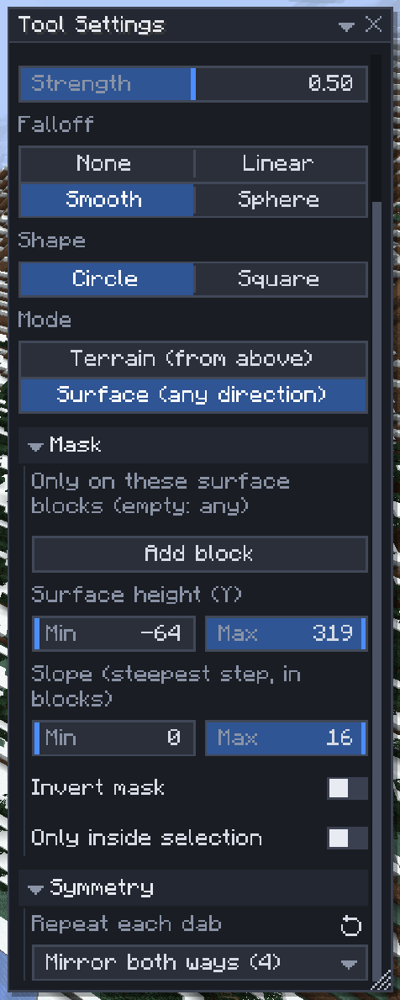

# Symmetry

[Home](home.md) · [Build faster](home.md#build-faster)

Symmetry repeats what you do on mirrored or turned copies around one shared centre. Brush one wing of a castle and the other wing follows; carve one side of a gateway and the other side is carved too. Use it for anything with a mirror line or a centre: facades, towers, gardens, ships.

## Use symmetry

1. Point at the block that should be the centre and press `M`. With `Shift+M` the centre is the nearest block corner instead. Pressing `M` on the same point again clears it.
2. In Tool Settings, click the **Symmetry** section header and pick a mode. The centre and the mirror planes show in the world.
3. Work as usual: the copies follow every dab, operation and placement.

| Mode | Copies |
|---|---|
| Mirror east / west | One, mirrored across a north–south plane through the centre |
| Mirror north / south | One, mirrored across an east–west plane |
| Mirror both ways (4) | Three: one in each quarter |
| Rotate, half turn (2) | One, turned 180° around the centre |
| Rotate, quarter turns (4) | Three, turned 90° each |

## Where it works

The terrain brushes, the [Shape brush](shape-brush.md), the [Fluid](fluid.md) ball, the Select tool's operations (Fill, Replace, Erase, Hollow, Walls), [Place](place.md)'s paste, move and stack, and [Extrude](extrude.md). Each tool has its own Symmetry setting, so a symmetric brush doesn't make your pastes symmetric. In [builder mode](builder-mode.md), the **Mirror** power uses the Place tool's mode.

## Tips

- Use `Shift+M` (a block corner) for a build with an even width, `M` (a block centre) for an odd one; otherwise the copies are one block off.
- Brush copies follow the terrain under them; Shape brush copies stay at the shape's height.
- With a mode on but no centre set, Select's operations, Place and Extrude refuse to run and ask for the centre; the brushes use the selection's centre if there is one.
- A [preset](presets.md) keeps the mode but not the centre, which belongs to one world.

## Related

- [Terrain brushes](terrain-brushes.md)
- [Selection operations](selection-operations.md)
- [Builder mode](builder-mode.md)
