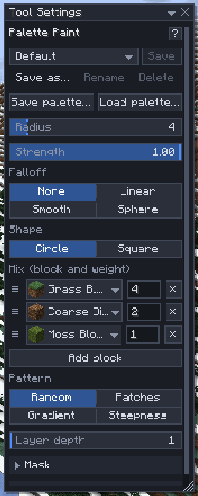

# Terrain brushes

[Home](home.md) · [Shape the land](home.md#shape-the-land)

Six brushes shape and paint natural ground: **Raise** (`2`), **Lower** (`3`), **Smooth** (`4`), **Flatten** (`5`), **Paint** (`6`) and **Palette Paint** (`7`). They work on the surface you aim at, ground, wall or ceiling alike, and leave stairs, fences, slabs and chests alone, so a stroke never eats a build. Use them for hills, cliffs, riverbeds, cave walls and the ground cover on top.

## Use a brush

1. Press `2` to `7`.
2. Point at a surface: the ring lies on it and shows the radius. It stays visible through terrain, fainter where it is hidden.
3. Left-drag over the surface. Hold `Alt` to swap Raise and Lower.
4. `Ctrl+Scroll` changes the radius (`Shift`: steps of 4), `Alt+Scroll` the strength.

Each press is one undo step (changing the radius or strength mid-press starts a new one). Raise pushes the surface out the way it faces, Lower pulls it in, Smooth evens out bumps and dents, and Flatten levels to the face where the stroke began: level on ground, upright on walls. Hold the button still and the brush keeps working: Raise grows a mound, Flatten keeps levelling until it reaches its plane. The first dab of Flatten always moves the surface at least one block, so a light touch still does something.

## Paint

1. Pick **Paint** and set its **Material**: click the block in Tool Settings, or middle-click a block in the world.
2. Drag over the ground: the top **Layer depth** blocks become the material.
3. For a mix, use **Palette Paint**: middle-click blocks to add them, set their weights, and pick a [pattern](mix-patterns.md) (Random, Patches, Gradient or Steepness).

## Settings

| Setting | What it does |
|---|---|
| Mode | **Surface (any direction)**: the surface you aim at. **Terrain (from above)**: moves whole columns; faster for big landscapes, never makes overhangs |
| Radius | 1–32 blocks (the server may allow less) |
| Strength | How much each dab does, 0–1: blocks per dab for Raise and Lower, a share of the way for Smooth and Flatten |
| Falloff | How the strength fades to the edge: None, Linear, Smooth, Sphere |
| Shape | A circle or a square footprint |
| Layer depth | How deep Paint repaints, 1–32 |
| Mask, Symmetry | Where the brush may work ([Masks](masks.md)), and mirrored copies ([Symmetry](symmetry.md)) |

## Tips

- Surface Raise, Lower and Flatten reach 8 blocks past the radius along the way the surface faces, so a held Raise on a cliff grows a proper mound instead of a spike.
- A dashed ring means the brush is too big to preview on your side: the change shows a moment after the click.
- To build up a slope, Raise with a low strength and a Smooth or Sphere falloff, then Smooth once over the whole thing.
- The brushes need the `brush` [permission](permissions.md).

## Related

- [Masks](masks.md)
- [Mix patterns](mix-patterns.md)
- [Shape brush](shape-brush.md)
- [Palettes](palettes.md)
