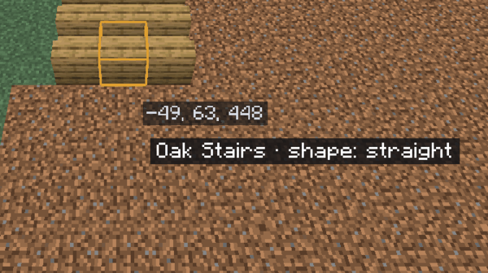

# Tinker

[Home](home.md) · [Select and change blocks](home.md#select-and-change-blocks)

The **Tinker** tool (`]`) changes one block or one entity where it stands: a stair's shape, a door's hinge, a sign's text, an armor stand's pose, a painting's picture. Use it for the last touches a fill or paste can't do, instead of breaking and replacing the block. Changes are made without block updates, so the block stays exactly as you set it.

## Blocks

1. Press `]` and point at a block. It gets an orange outline, and a label beside the pointer names it and one property: "Oak Stairs · shape: outer left".
2. **Scroll** to go through that property's values. Each notch is a change on the server and an undo step (a fast run of notches may merge into fewer).
3. **Shift+Scroll** to move to another property. Tinker shows the useful ones first (shape, facing, half, open…) and remembers your choice for that kind of block until you close the game.
4. **Click** the block to open its panel: every property as a drop-down, the text for a sign, and **Apply to all**.

A door or a tall plant changes both halves together. Over a block with nothing to change, plain scrolling changes the fly speed as usual.

## Apply to all

In the panel, **Apply to all like it in the selection** sets the property shown on every block of the same kind in your [selection](select.md), as one undo step. Their other properties and every other block stay as they are. The button needs a selection.

## Sign text

A sign's panel has **Front** and **Back**: four lines each, a colour and **Glowing**. Click **Set text**. The text is plain: formatting codes are dropped.

## Entities

Point at an armor stand, item frame, painting or display entity: it gets an outline. **Click** it for its panel.

| Entity | In its panel |
|---|---|
| Armor stand | Pose (three angles per part), Facing, Small, Show arms, No base plate, Invisible, No gravity |
| Item frame | Item rotation, Invisible, Fixed |
| Painting | Picture |
| Block, item or text display | Translation, rotation, scale, Billboard, fixed light, and the block, item or text it shows |

**Move and turn** buttons move it by 1/16 or 1 block along x, y and z (frames and paintings by whole blocks) and turn it by 15°. **Scroll** over an armor stand or display turns it by 15° (`Shift`: 1°); over an item frame it turns the item.

## Tips

- Turn on **No gravity** before moving an armor stand into the air, or it falls back down.
- A picture too large for its wall is refused and the painting stays; a bed's facing is refused too (move the bed instead).
- Tinker needs the `region` [permission](permissions.md). In [builder mode](builder-mode.md), the Tinker power gives you the scroll and a small panel outside the editor.

## Related

- [Selection operations](selection-operations.md)
- [Builder mode](builder-mode.md)
- [History](history.md)
