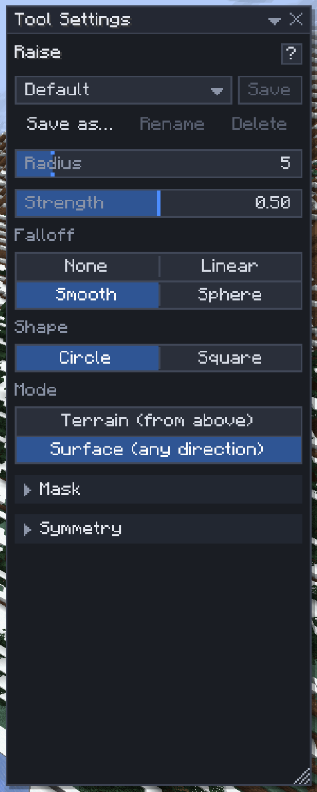

# Tool Settings

[Home](home.md) · [Settings and keys](home.md#settings-and-keys)

The **Tool Settings** window, at the right of the screen, holds the active tool's settings: radius and strength for a brush, shape and mode for the Shape brush, the mix for Palette Paint. Each tool has its own, changes apply at once, and every tool remembers its settings when you restart the game.

## Change a setting

1. Hover a setting to read what it does.
2. Click a choice or a switch, drag a slider, or click a block to pick another one.
3. To type a number, double-click the slider (or `Ctrl+click` it), type the value and press `Enter`. `Esc` cancels.
4. Click **↺** beside a changed setting to put it back to its default.

Sections such as **Mask** and **Symmetry** are folded: click the header to open one. The **?** beside the tool's name opens the tool's page in this wiki.

## The mix rows

Palette Paint, the Shape brush, Fill and Generate take a list of blocks with weights. **Add block** adds a row; middle-click a block in the world adds it too. Set a weight of 1–1000 per row, and drag a row by its **≡** handle to reorder it, which matters for the [Gradient and Steepness patterns](mix-patterns.md).

## Kept across restarts

Every tool's settings are saved on your computer (`config/sculptory/editor-tool-settings.json`), 750 ms after a change and when the editor closes. On the next start they come back as they were, fitted to the server's limits if a server allows less. Not kept: the symmetry centre and the gradient line, which belong to one world.

## Tips

- `Ctrl+Scroll` over the world changes the tool's size (`Shift`: steps of 4), `Alt+Scroll` its strength or height, without touching the window.
- `Ctrl+K` finds a setting of the active tool by name, and a [preset](presets.md) by name.
- A [preset](presets.md) keeps a whole setup under a name, so you can switch between two setups of one tool.
- `F6` puts the keyboard into the window: `Tab` moves between controls, `Esc` gives the keyboard back.

## Related

- [Presets](presets.md)
- [Keys](keys.md)
- [The screen and windows](screen-and-windows.md)
